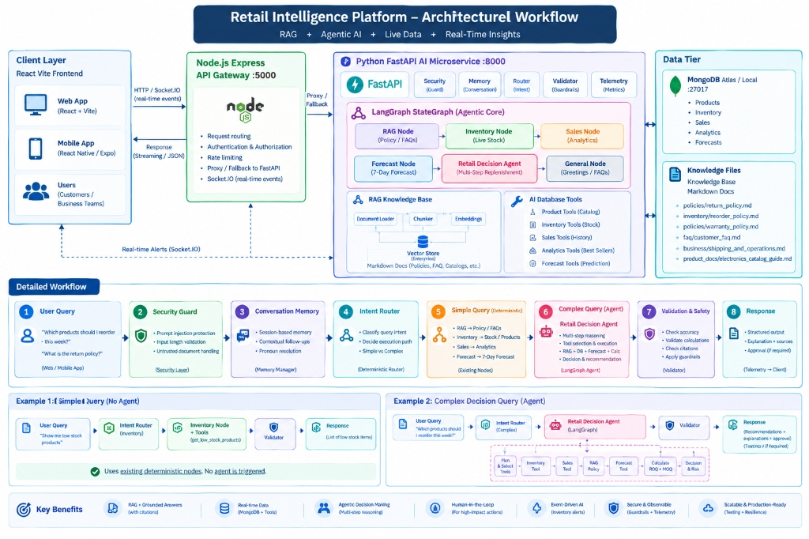

# Retail Intelligence Platform — Production-Ready RAG + Agentic AI

An enterprise-grade **Retail Intelligence Platform** combining **Node.js Express**, **Python FastAPI**, **LangChain**, **LangGraph**, **RAG Vector Search**, **MongoDB Database Tools**, and **React Vite** frontend.

---

## 🏗️ System Architecture & Workflow



### 🌟 High-Level Architectural Flow

```
+---------------------------------------------------------------------------------------------------------+
|                                           CLIENT LAYER                                                  |
|                      React + Vite Web App (Dashboard & Chatbot) | Mobile App (React Native)              |
+---------------------------------------------------+-----------------------------------------------------+
                                                    | HTTP / WebSocket (Socket.IO)
                                                    v
+---------------------------------------------------------------------------------------------------------+
|                                    API GATEWAY (Node.js Express :5000)                                  |
|   - Request Routing & Auth  - Rate Limiting  - Socket.IO Real-Time Alerts  - Proxy / Fallback to AI    |
+---------------------------------------------------+-----------------------------------------------------+
                                                    | REST / Streaming
                                                    v
+---------------------------------------------------------------------------------------------------------+
|                              AI MICROSERVICE (Python FastAPI :8000)                                     |
|                                                                                                         |
|  [Security Guard] ---> [Conversation Memory] ---> [Deterministic Router]                               |
|                                                              |                                          |
|                +---------------------------------------------+------------------------------------+     |
|                | (Simple Queries - Deterministic)                 | (Complex Decision Queries)    |     |
|                v                                                  v                               |     |
|   +--------------------------+                      +---------------------------------------+     |     |
|   | Deterministic Nodes:     |                      | Retail Decision Agent (LangGraph):    |     |     |
|   | - RAG Node (Policies)    |                      | 1. Plan & Tool Selection              |     |     |
|   | - Inventory Node (Stock) |                      | 2. Fetch Live Stock & 30-Day Sales    |     |     |
|   | - Sales Node (Analytics) |                      | 3. RAG Reorder Policy & Lead Times    |     |     |
|   | - Forecast Node (7-Day)  |                      | 4. Deterministic ROQ & MOQ Math Engine|     |     |
|   | - General Node (Chat)    |                      | 5. Risk, Priority & Purchase Order    |     |     |
|   +------------+-------------+                      +-------------------+-------------------+     |     |
|                |                                                        |                         |     |
|                +--------------------------------------------------------+                         |     |
|                                                    v                                              |     |
|                                       [Validation & Guardrails]                                   |     |
|                                                    v                                              |     |
|                                       [Telemetry & Response]                                      |     |
+----------------------------------------------------+----------------------------------------------------+
                                                     |
                                    +----------------+----------------+
                                    |                                 |
                                    v                                 v
+-------------------------------------------------------+   +---------------------------------------------+
|               DATA TIER: MongoDB Atlas/Local          |   |          ENTERPRISE KNOWLEDGE BASE          |
|   - Products Catalog       - Inventory Stock          |   |   - policies/return_policy.md               |
|   - Sales Orders (30-day)  - Predictive Forecasts     |   |   - inventory/reorder_policy.md             |
+-------------------------------------------------------+   |   - policies/warranty_policy.md             |
                                                            |   - faq/customer_faq.md                     |
                                                            |   - business/shipping_and_operations.md    |
                                                            |   - product_docs/electronics_guide.md       |
                                                            +---------------------------------------------+
```

### 🔄 End-to-End Workflow Pipeline

1. **User Query**: Users query via the React web frontend or mobile app (e.g., *"Which products should I reorder this week?"* or *"What is the return policy for electronics?"*).
2. **Security Guard (`SecurityGuard`)**: Inspects query against prompt injection patterns, validates length (< 2,000 chars), and sanitizes untrusted input.
3. **Conversation Memory (`ConversationMemoryManager`)**: Restores multi-turn session history, resolves pronouns (*"Which one?"*, *"How many of the first one?"*), and provides context.
4. **Deterministic Intent Router (`RouterNode`)**: Zero-overhead classification that routes queries directly:
   - **Simple Path (Fast & Deterministic)**: RAG for FAQs, live MongoDB queries for inventory and sales. No agent overhead.
   - **Complex Path (Agentic AI)**: Dispatches to the `RetailDecisionAgent` for multi-step reasoning.
5. **Retail Decision Agent Execution**:
   - Gathers current inventory levels and deficit stock.
   - Computes 30-day sales velocity ($V = \frac{\text{Sales}}{30}$).
   - Queries RAG knowledge base for supplier lead times, buffer safety stock, and category MOQs.
   - Executes deterministic replenishment calculation engine (never LLM hallucination).
   - Classifies stock risk (CRITICAL, HIGH, MODERATE, LOW) and reorder priority.
6. **Validation & Safety Guardrails (`ValidatorNode`)**: Enforces MOQ compliance, verifies source citations, checks numerical accuracy, and flags high-impact purchase orders with `requires_user_confirmation = true`.
7. **Client Response & Interactive Visuals**:
   - Structured JSON delivered via Node.js API gateway.
   - Rendered in React frontend with interactive Recharts comparison bar charts, stock health gauges, formula breakdown pills, and human-in-the-loop `[ Approve Order ]` / `[ Reject ]` buttons.


---

## 🚀 Core Features & Capabilities

### 1. Enterprise Knowledge RAG System
- **Domain Markdown Documents**: Enterprise policies located in `knowledge_base/` covering:
  - `policies/return_policy.md` (Return windows, conditions, restocking fees)
  - `inventory/reorder_policy.md` (Lead times, safety stock calculations, MOQs)
  - `policies/warranty_policy.md` (Standard & extended warranty terms)
  - `faq/customer_faq.md` (Customer support, payments, order tracking)
  - `business/shipping_and_operations.md` (Fulfillment guidelines & SLA)
  - `product_docs/electronics_catalog_guide.md` (Product specs & handling)
- **Vector Retrieval**: Top-$k$ semantic search with cosine similarity and cosine distance scoring.
- **Strict Citation Grounding**: Every RAG answer cites source filenames, sections, and page numbers with zero hallucination.

### 2. Live Database Tools (LangChain `@tool`)
- `get_products` & `get_product_details`: Live catalog lookup.
- `get_low_stock_products`, `get_inventory_status`, `get_inventory_value`: Live warehouse valuation and stock alerts.
- `get_sales` & `get_sales_analytics`: 30-day revenue and order tracking.
- `get_top_selling_products`: Performance ranking by volume and revenue.
- `get_sales_forecast`: 7-day predictive sales projections.
- **Multi-Tier Database Resilience**: Automatic fallback hierarchy (Direct PyMongo $\rightarrow$ Node.js Gateway $\rightarrow$ Offline cached snapshot).

### 3. LangGraph Multi-Step Agentic Reasoning
- Flagship **Autonomous Replenishment Agent**:
  1. Calls `get_low_stock_products` for items under minimum stock thresholds.
  2. Queries `get_sales(days=30)` to calculate exact 30-day demand velocity.
  3. Retrieves `reorder_policy.md` via RAG to obtain category lead times and MOQs.
  4. Applies Economic Reorder Quantity formula:
     $$\text{ROQ} = (\text{Daily Velocity} \times \text{Lead Time}) + \text{Safety Stock} - \text{Current Stock}$$
  5. Enforces Minimum Order Quantities (MOQ) and generates structured purchase order recommendations.

### 4. Real-Time Event-Driven AI
- `POST /ai/events/inventory-update`: Automatically evaluated upon stock adjustments in Node backend.
- Dispatches proactive `inventory:alert` events over Socket.IO to connected web clients with actionable replenishment recommendations.
- Non-destructive safety guardrails (`requiresUserConfirmation: true`).

### 5. Multi-Turn Conversation Memory
- Session-based conversation memory (`ConversationMemoryManager`) supporting contextual pronoun resolution (*"Which one has highest sales?"*, *"How many should we reorder?"*).
- Clean separation between short-term conversational context and enterprise vector embeddings.

### 6. Production Observability & Security
- **Telemetry (`/ai/metrics`)**: Aggregate request counts, latency percentiles (p50, p95, p99), and tool distribution.
- **Security Guard (`SecurityGuard`)**: Prompt injection / jailbreak regex protection, message length validation (max 2,000 chars), and untrusted document context wrapping.
- **Performance Cache (`SimpleCache`)**: In-memory response caching for sub-10ms latency on repeated queries.

---

## 🛠️ Quick Start & Setup

### Prerequisites
- Node.js 18+ and npm
- Python 3.10+ (tested on Python 3.14)
- MongoDB running locally on port 27017 or MongoDB Atlas connection URI

---

### Step 1: Start the Python AI Microservice

```powershell
cd ai-service

# Create and activate virtual environment
python -m venv venv
.\venv\Scripts\activate

# Install dependencies
pip install -r requirements.txt

# Run the FastAPI server
python -m uvicorn app:app --host 0.0.0.0 --port 8000 --reload
```
*The AI microservice will start on `http://localhost:8000` with interactive API docs at `http://localhost:8000/docs`.*

---

### Step 2: Start the Node.js Express Backend

```powershell
cd backend

# Install dependencies
npm install

# Copy environment variables
cp .env.example .env

# Start Node backend
npm run dev
```
*The Express gateway will start on `http://localhost:5000`.*

---

### Step 3: Start the React Web Frontend

```powershell
cd web

# Install dependencies
npm install

# Start Vite dev server
npm run dev
```
*Open `http://localhost:5173` in your browser to access the Retail Intelligence Dashboard and AI Assistant.*

---

## 🧪 Running Automated Tests

Run the complete test suite (50 tests covering RAG, Tools, Router, LangGraph, Memory, Security, Error Handling, and End-to-End flows):

```powershell
cd ai-service
.\venv\Scripts\python.exe -m pytest tests/ -v
```

---

## 📡 API Endpoints Reference

| Endpoint | Method | Description |
| :--- | :--- | :--- |
| `/ai/chat` | `POST` | Primary conversational AI endpoint with LangGraph agent orchestration |
| `/ai/events/inventory-update` | `POST` | Real-time event handler for proactive stock alerts |
| `/ai/metrics` | `GET` | Telemetry endpoint for request counters, latency percentiles, and tool usage |
| `/ai/health` | `GET` | Health check for RAG, LangGraph, tools, memory, and database |
| `/ai/memory/{session_id}` | `DELETE` | Clears active conversation memory for a given session |
| `/docs` | `GET` | Interactive Swagger API documentation |

---

## 🏆 Project Acceptance Benchmarks Verified

- [x] **Scenario 1 (RAG Policy)**: *"What is the return policy for electronics?"* $\rightarrow$ Cited source documents and 30-day window returned.
- [x] **Scenario 2 (Live Database)**: *"Which products are currently low in stock?"* $\rightarrow$ Live MongoDB inventory items evaluated without triggering RAG.
- [x] **Scenario 3 (Analytics & Charts)**: *"What were our top-selling products in the last 30 days?"* $\rightarrow$ Returns ranked sales figures and Bar chart dataset.
- [x] **Scenario 4 (Hybrid Agent Decision)**: *"Which products should I reorder based on current inventory, the last 30 days of sales, and our reorder policy?"* $\rightarrow$ Multi-step agent orchestrates Live Inventory + 30-Day Sales Velocity + RAG Reorder Policy to calculate Economic Reorder Quantities with transparent mathematical reasoning.
